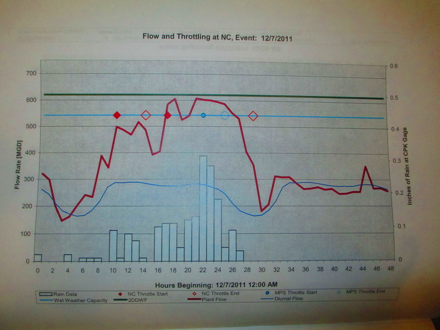
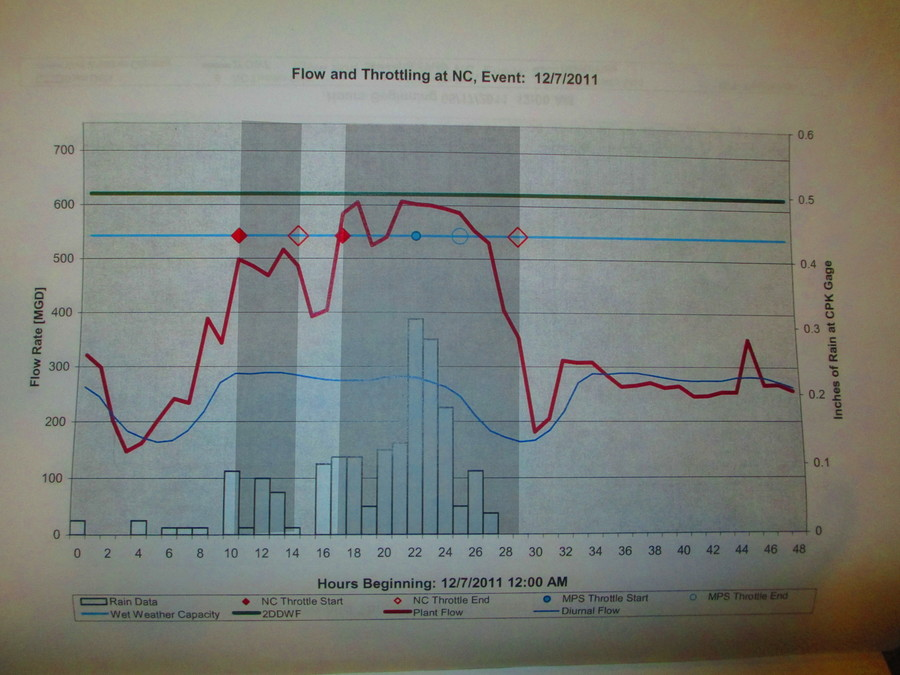
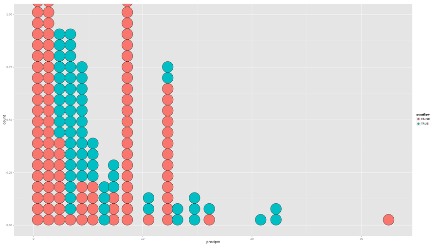

Using recent rainfall figures to predict Newtown Creek sewer overflows
===

## Goal
We want to predict whether a sewer will overflow soon based on current
rainfall data in order to make [DontFlush.me](http://dontflush.me)'s alerts
more relevant.

## Data sources

### Overflow statistic
We received a book from a FOIA request. This book contains graphs of, among
other things, sewer overflow incidents in New York City during the top 10
storms of 2011 for each of the 14 sewage treatment plants.

> Dates of the top ten storms, in the order they are presented in the book
> 
> * 8/14/2011
> * 8/27/2011
> * 9/6/2011
> * 3/6/2011
> * 4/16/2011
> * 11/22/2011
> * 10/29/2011
> * 9/23/2011
> * 5/17/2011
> * 12/7/2011

For each of these 10 storms, the graphs present a 48-hour or 60-hour window
of data around the storm. For 60-hour widows, we only used the first 48-hours.
This results in a total of 7720 observation-hours, with one observation per
hour.

### Rainfall statistic
We collected rainfall statistics from Weather Underground. We chose this
because of the [practical applications blah blah]

## Methods

### Data collection
We focused on the Newtown Creek sewershed. We have 480 observation-hours
(10 storms at 14 plants) in the book. We measured overflow as hours between
an NC throttle start (solid diamond) and an NC throttle end (empty diamond),
inclusive. For example, the two darkened bands on this plot, from hours t1
to t2, indicate overflow periods.

The MPS throttle start (solid circle) and end (empty circle) apparently
indicates overflows coming from the Manhattan pump station, which gets sent
through the Newtown Creek station. We ignored these overflows.

For each of these hours, we also acquired the most recent observation from
Weather Underground. This resulted in a table that looked like this.

    Date  Hour After 9 am  Overflowing?  Last rainfall figure
    ----  ---- ----------  ------------  --------------------
               No          Yes

To account for the diurnal flow, we added an "after 9 am" variable, which was
"no" for midnight to 9 am and "yes" for 10 am on.

    Date  Hour After 9 am  Overflowing?  Last rainfall figure
    ----  ---- ----------  ------------  --------------------
               No          Yes

### Model
We used the following model (in R formula syntax).

    overflowing ~ Last rainfall figure + after 9 am

We also made some plot

blah blah

Figure out
* that weird spike of falses
* 100 records lost in the join
* what family of distribution should the rainfall follow theoretically

Add the pictures.
Verify the paper API data by connecting frank's, tom's and casey's.

## Conclusions
2 mm is a decent cut-off for the guess

something about whether after 9 am matters

## Remaining tasks

1. ~~Get throttling events: Input throttling data from Paper API~~
2. ~~Get precipitation events: Convert Weather data from JSON to CSV~~
3. ~~Build algorithm to correlate throttling events with precipitation events~~
4. Refactor alert system to leverage algorithm from step 3
5. Visualize alert data (TBD)

## Contributors
* Leif: gathering weather data and data entry (http://github.com/lpercifield)
* Tom: understanding the stats and data entry (http://github.com/tlevine)
* Carl: visualization of weather data (http://github.com/c4rl)
* Casey: data entry and calculations (http://github.com/caseytwebb)
* Mike: data visualzation and structure in tableau (http://github.com/acceleratormt)
* Frank: Excel expert

## Building the website
Run `./build.sh`, then check out the `gh-pages` branch, wrap the `index.html`
in the head and foot, and move the files in `tmp` to the repository root.

    git checkout master
    ./build.sh
    git checkout gh-pages
    mv tmp/*.png tmp/*.jpg .
    cat template/index.html.head tmp/index.html template/index.html.foot > index.html
